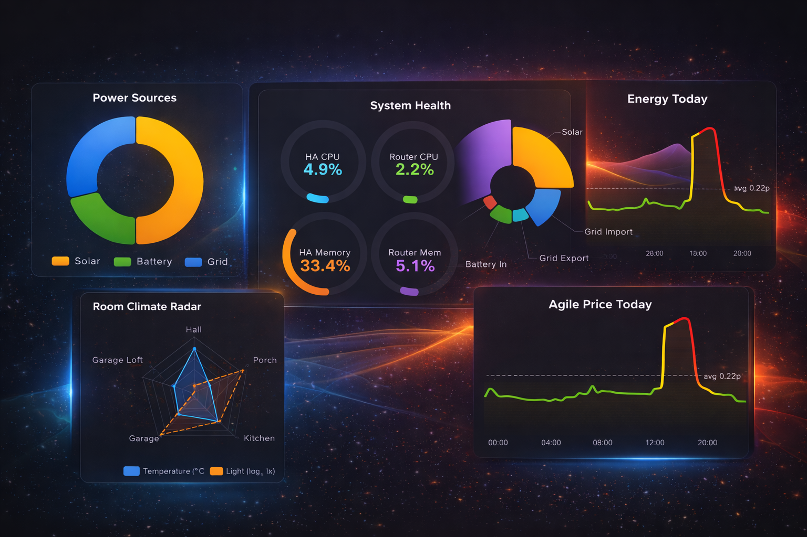
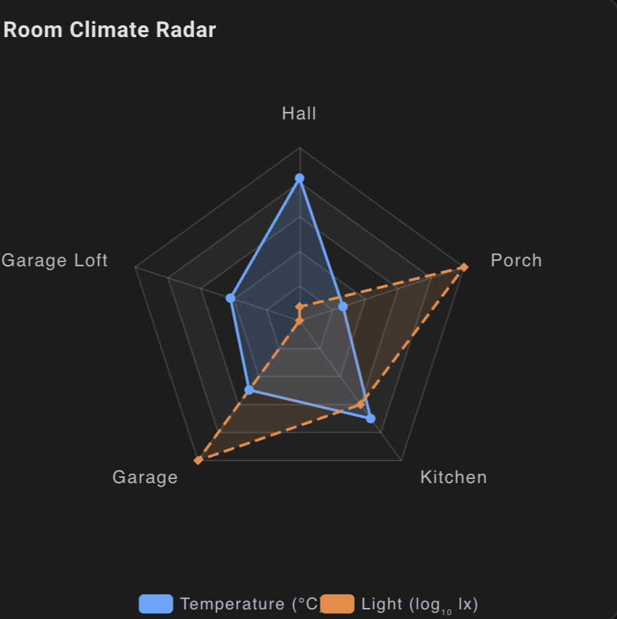
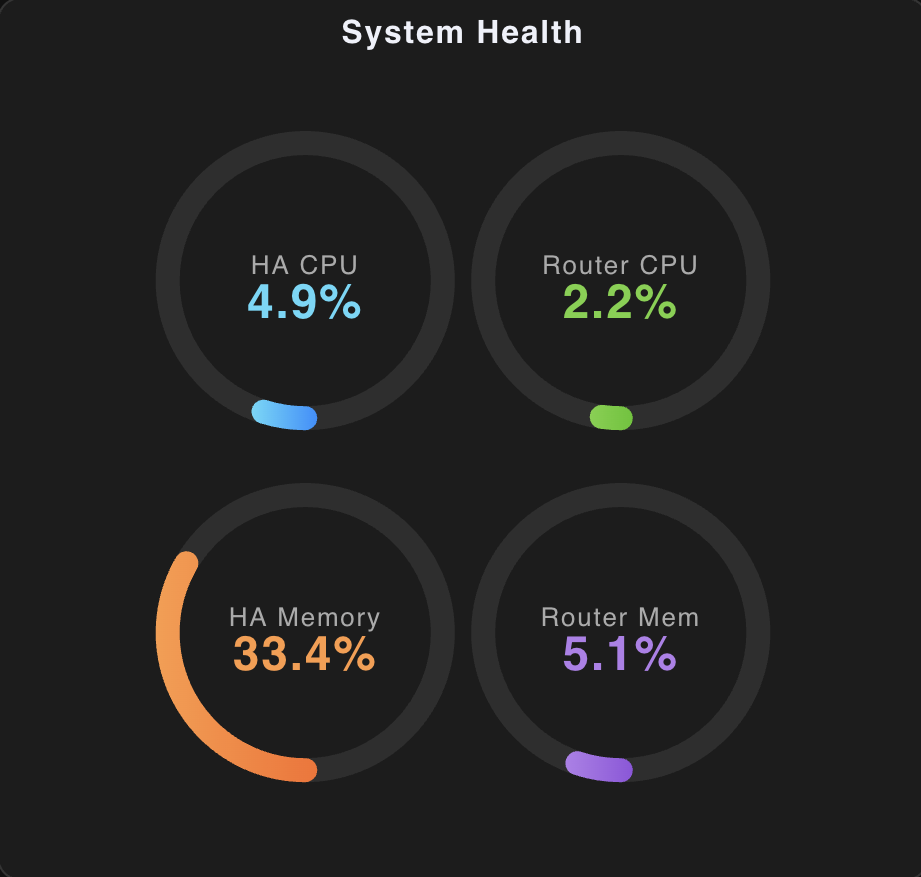
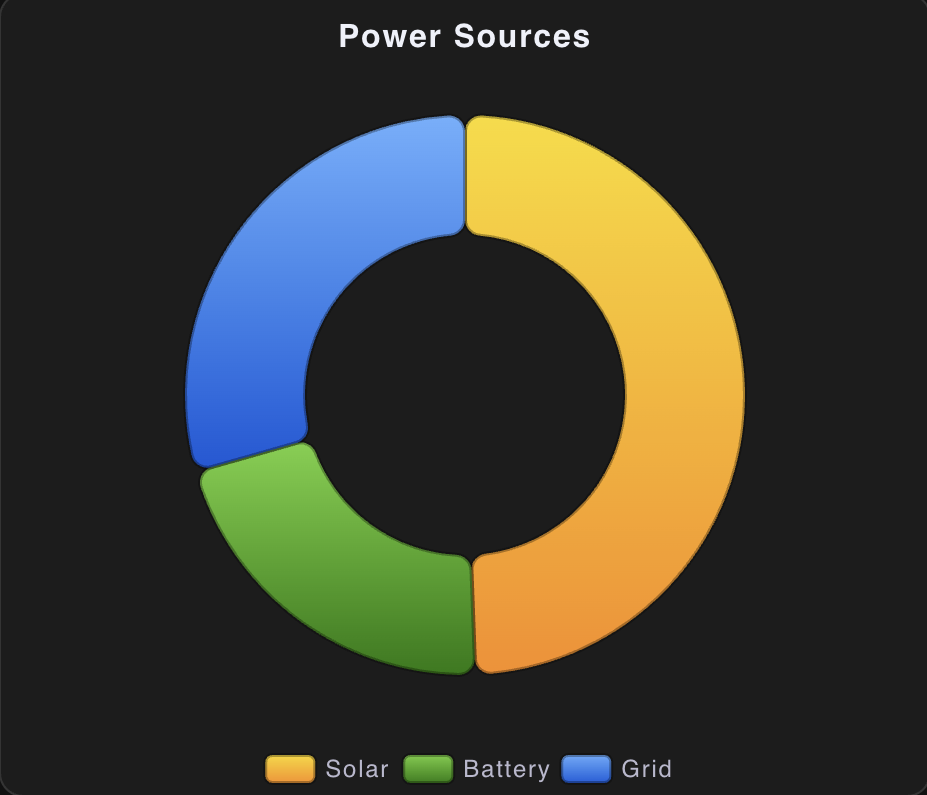
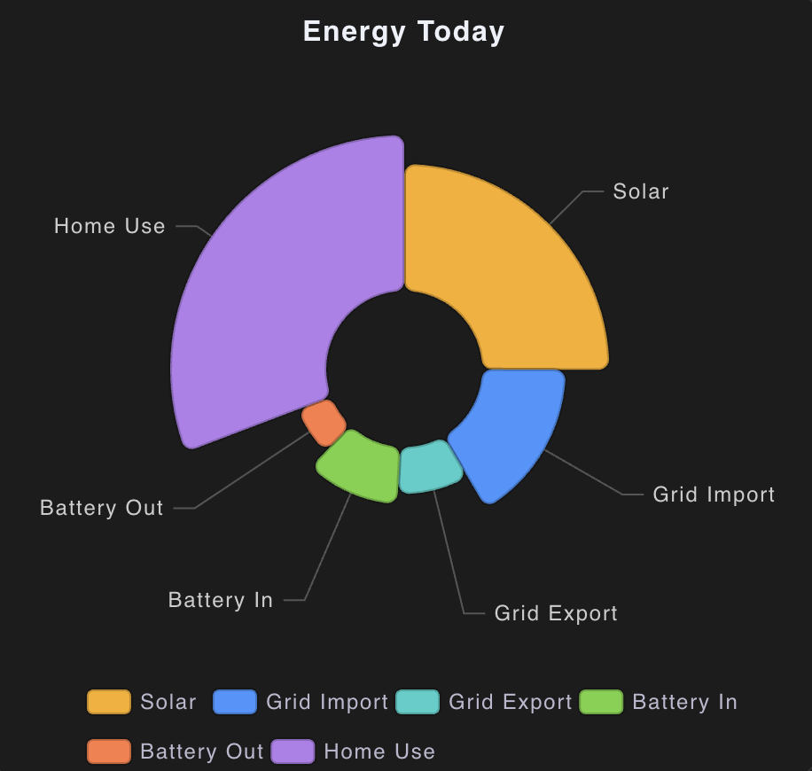
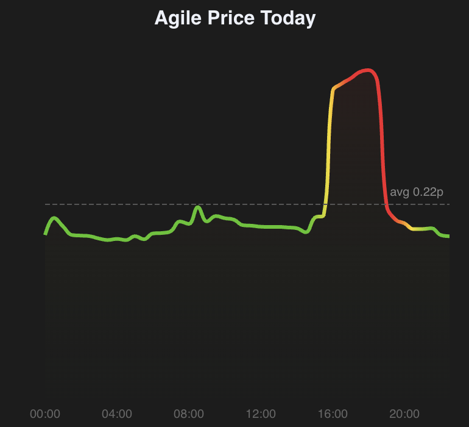
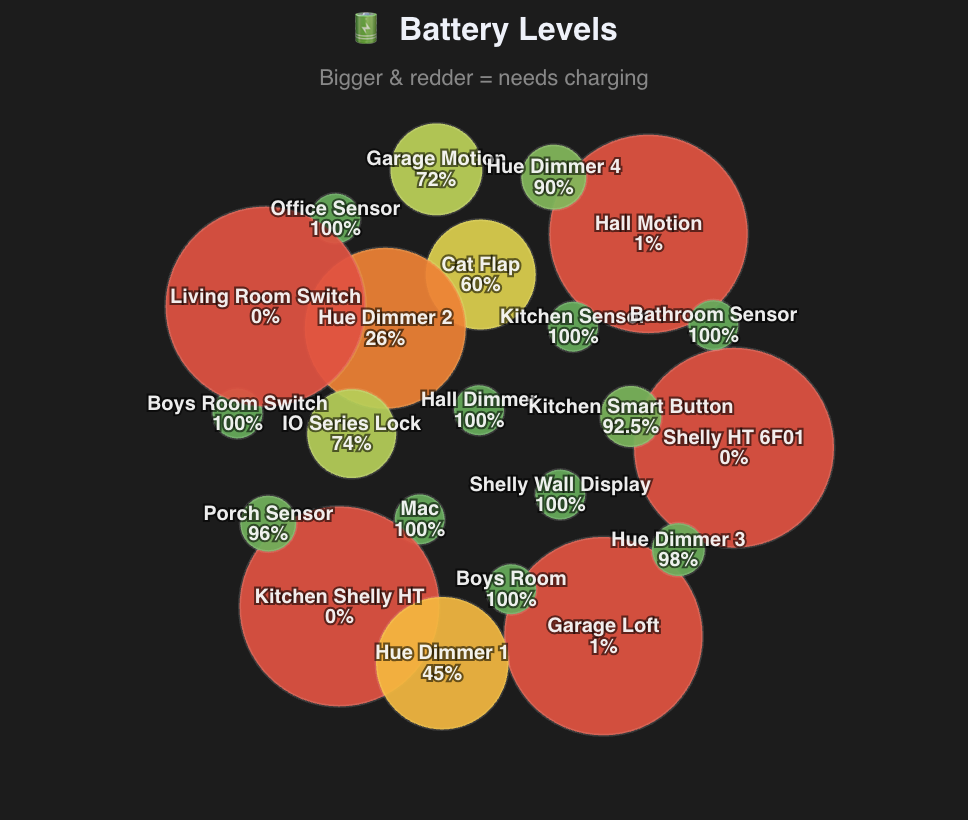

# ECharts Raw Card (Lovelace)

[](https://github.com/rsr5/lovelace-echarts-raw-card/actions/workflows/ci.yml)
[](https://opensource.org/licenses/MIT)
[](https://hacs.xyz)

A **power-user Home Assistant Lovelace card** that renders **raw Apache ECharts options**, with **native Home Assistant entity binding**, **history queries**, **statistics aggregation**, **transforms**, and **automatic dark-mode support**.

Unlike most chart cards, this one does **not** invent a DSL for charts — you write **real ECharts `option` objects**, and this card resolves Home Assistant data into them.

<p align="center">
  
</p>

<p align="center">
  <a href="https://rsr5.github.io/lovelace-echarts-raw-card/">📖 Full Documentation &amp; Examples</a> ·
  <a href="https://echarts.apache.org/examples/">ECharts Gallery ↗</a>
</p>

---

## Features

- ✅ Full **Apache ECharts** `option` support (no abstraction layer)
- ✅ Live entity binding via `$entity` tokens
- ✅ Bulk entity extraction via `$data`
- ✅ Historical data via `$history`
- ✅ Aggregated statistics via `$statistics` (daily/hourly/weekly totals, means, deltas)
- ✅ Built-in transforms (log, scale, clamp, round, etc.)
- ✅ Attribute reading via `$attr`
- ✅ Efficient LRU caching + throttling for history queries
- ✅ Automatic dark/light mode switching (uses ECharts `dark` theme)
- ✅ Canvas or SVG renderer
- ✅ Zero external dependencies beyond ECharts

---

## Installation (HACS)

1. HACS → **Frontend** → **Custom repositories**
2. Add this repository  
   - Category: **Lovelace**
3. Install
4. Add the resource:
   - **Settings → Dashboards → Resources**
   - URL:  
     ```
     /hacsfiles/lovelace-echarts-raw-card/echarts-raw-card.js
     ```
   - Type: **JavaScript Module**

---

## Demo Gallery

<table>
  <tr>
    <td align="center"><strong>🕸️ Radar</strong><br/>Room Climate<br/></td>
    <td align="center"><strong>🌡️ Gauges</strong><br/>System Health<br/></td>
  </tr>
  <tr>
    <td align="center"><strong>🍩 Donut</strong><br/>Power Sources<br/></td>
    <td align="center"><strong>🌸 Nightingale</strong><br/>Energy Today<br/></td>
  </tr>
  <tr>
    <td align="center"><strong>⚡ Agile Pricing</strong><br/>Octopus half-hourly rates with dynamic average<br/></td>
    <td align="center"><strong>🔋 Battery Bubbles</strong><br/>Force-clustered battery levels with size &amp; colour by charge<br/></td>
  </tr>
</table>

> All charts are **live** — data comes from real Home Assistant entities via `$entity` and `$attr` tokens. See the [full documentation](https://rsr5.github.io/lovelace-echarts-raw-card/) for complete YAML configs.

---

## Quick Start

```yaml
type: custom:echarts-raw-card
title: Weekly Example
height: 320px
option:
  tooltip: {}
  xAxis:
    type: category
    data: [Mon, Tue, Wed, Thu, Fri, Sat, Sun]
  yAxis:
    type: value
  series:
    - type: line
      data: [150, 230, 224, 218, 135, 147, 260]
```

---

## Debugging

Add `debug` at the **top level of the card config** (a sibling of `option`, not inside it).

### Quick enable

```yaml
type: custom:echarts-raw-card
debug: true
option:
  ...
```

### Fine-grained debug

```yaml
type: custom:echarts-raw-card
debug:
  show_resolved_option: true
  log_resolved_option: true
  max_chars: 20000
option:
  ...
```

### Where the output goes

- **In-card panel**: when `show_resolved_option` is enabled, the card shows an expandable
  "Debug: resolved ECharts option" section.
- **Browser console**: when `log_resolved_option` is enabled, the card logs the resolved
  option with `console.debug`.

Notes:

- Some browsers hide `console.debug(...)` unless the console log level includes **Verbose**.
- The card only produces "resolved option" debug after it can render (the container must have
  a non-zero size). During Lovelace layout/view transitions the card can temporarily be 0×0, in
  which case option application (and debug) is deferred.

---

## Entity Tokens (`$entity`)

You can bind **any Home Assistant entity** directly into the chart.

```yaml
option:
  series:
    - type: gauge
      min: 0
      max: 100
      data:
        - value:
            $entity: sensor.living_room_humidity
            $coerce: number
            $round: 1
```

### Token fields

| Field | Purpose |
|------|---------|
| `$entity` | Entity ID |
| `$attr` | Attribute instead of state |
| `$coerce` | `auto` \| `number` \| `string` \| `bool` |
| `$default` | Fallback if unavailable |
| `$abs` | Absolute value |
| `$scale` | Multiply |
| `$offset` | Add |
| `$min` / `$max` | Clamp bounds |
| `$clamp` | `[min, max]` |
| `$round` | Decimal places |
| `$map` | `log`, `sqrt`, or `pow` |

---

## `$data`: Bulk Entity Extraction

Use `$data` when you want **multiple entities turned into chart data automatically**.

```yaml
option:
  series:
    - type: pie
      radius: 60%
      data:
        $data:
          entities:
            - sensor.power_kitchen
            - sensor.power_living_room
            - sensor.power_office
          mode: pairs
          name_from: friendly_name
          coerce: number
          exclude_zero: true
          sort: desc
```

### `$data` modes

| Mode | Output |
|------|--------|
| `pairs` | `{ name, value }[]` |
| `names` | `string[]` |
| `values` | `unknown[]` (use `coerce: number` to ensure numeric output) |

### `$data` notes

- Unavailable/unknown entities are **excluded by default** (`exclude_unavailable: true`).
- `include_unavailable` exists for backwards compatibility, but `exclude_unavailable` is the preferred flag.

---

## `$history`: Historical Data

Fetch Home Assistant history **directly into ECharts**.

### Single-entity history

```yaml
option:
  xAxis:
    type: time
  yAxis:
    type: value
  series:
    - type: line
      showSymbol: false
      data:
        $history:
          entities:
            - sensor.outdoor_temperature
          hours: 24
          coerce: number
```

---

### Multi-entity history → series

```yaml
option:
  xAxis:
    type: time
  yAxis:
    type: value
  series:
    $history:
      entities:
        - sensor.power_kitchen
        - sensor.power_living_room
      hours: 12
      mode: series
      series_type: line
      show_symbol: false
```

> If `mode` is omitted, it defaults to `values` for one entity or `series` for multiple.
> If `coerce` is omitted for `$history`, it behaves as `number`.

---

### Downsampling

```yaml
$history:
  entities:
    - sensor.energy_usage
  hours: 48
  sample:
    max_points: 300
    method: mean
```

---

### Per-series overrides

```yaml
$history:
  entities:
    - sensor.solar_power
    - sensor.grid_power
  series_overrides:
    Solar:
      areaStyle: {}
      smooth: true
```

Overrides may target **friendly name or entity ID**.

---

## `$statistics`: Aggregated Statistics

Fetch **pre-computed statistics** from Home Assistant's long-term statistics API — perfect for daily totals, weekly averages, monthly costs, and anything where raw history is too noisy or accumulative.

Unlike `$history` (which returns every recorded state change), `$statistics` returns **aggregated buckets** (e.g. one value per day) with proper delta handling via `stat_type: change`.

### Daily bar chart

```yaml
option:
  xAxis:
    type: time
  yAxis:
    type: value
  series:
    - type: bar
      data:
        $statistics:
          entities:
            - sensor.daily_energy_cost
          period: day
          stat_type: change
          days: 14
```

### Multi-entity series

```yaml
option:
  xAxis:
    type: time
  yAxis:
    type: value
  series:
    $statistics:
      entities:
        - sensor.solar_production
        - sensor.grid_import
      period: day
      stat_type: change
      days: 30
      mode: series
      series_type: bar
```

### Pie / donut aggregation

```yaml
option:
  series:
    - type: pie
      data:
        $statistics:
          entities:
            - sensor.power_kitchen
            - sensor.power_office
            - sensor.power_hvac
          period: day
          stat_type: sum
          days: 7
          mode: pairs
```

### `$statistics` options

| Field | Type | Default | Description |
|-------|------|---------|-------------|
| `entities` | string[] | *(required)* | Entity IDs |
| `period` | string | `day` | `5minute` · `hour` · `day` · `week` · `month` |
| `stat_type` | string | `change` | `mean` · `min` · `max` · `sum` · `change` · `state` |
| `days` | number | `14` | How many days of statistics to fetch |
| `start` / `end` | string \| number | — | Explicit time range (ISO string or epoch ms) |
| `mode` | string | auto | `values` (1 entity → `[ts, val][]`), `series` (→ ECharts series[]), `pairs` (→ `{name, value}[]`) |
| `name_from` | string | `friendly_name` | `friendly_name` or `entity_id` |
| `series_type` | string | `bar` | `line` · `bar` · `scatter` (used in `series` mode) |
| `cache_seconds` | number | `300` | Cache TTL (statistics don't change fast) |
| `series_overrides` | object | — | Per-series ECharts overrides keyed by name |

> **When to use `$statistics` vs `$history`:**  
> Use `$statistics` for **aggregated/bucketed data** (daily totals, hourly averages, cost deltas).  
> Use `$history` for **raw time-series** (live traces, minute-by-minute readings).

---

## Caching & Performance

- History requests are cached (`cache_seconds`, default 30s)
- Statistics requests are cached (`cache_seconds`, default 300s)
- Card throttles re-fetches automatically
- HA state churn does **not** spam history queries
- Multiple `$history` / `$statistics` blocks use the **minimum cache window**

```yaml
$history:
  entities: [sensor.foo]
  cache_seconds: 120
```

---

## Dark Mode

The card automatically switches ECharts theme based on Home Assistant UI mode:

- Light → default
- Dark → `dark` theme

No config required.

---

## Renderer

```yaml
renderer: canvas   # default
# or
renderer: svg
```

---

## Documentation

For **complete reference**, chart recipes, and full YAML configs, see the **[documentation site](https://rsr5.github.io/lovelace-echarts-raw-card/)**.

---

## Error Handling

- Errors are rendered inline
- Chart is safely cleared
- Resize/update loops are prevented

---

## License

MIT  
Copyright © 2026 Robin Ridler
